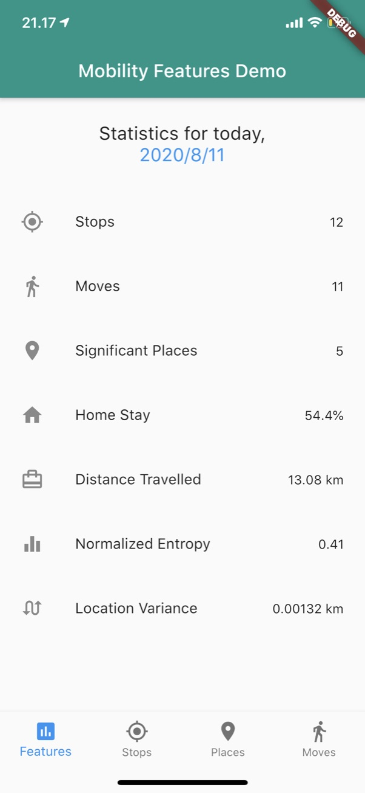
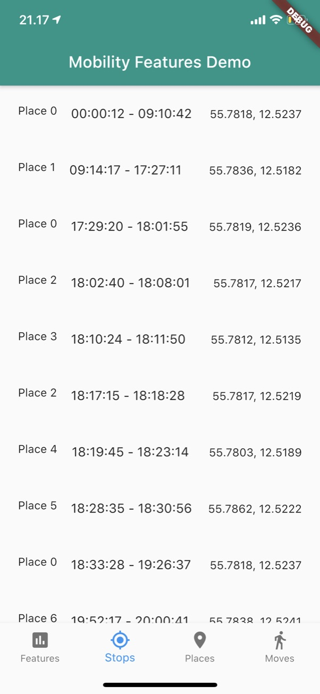
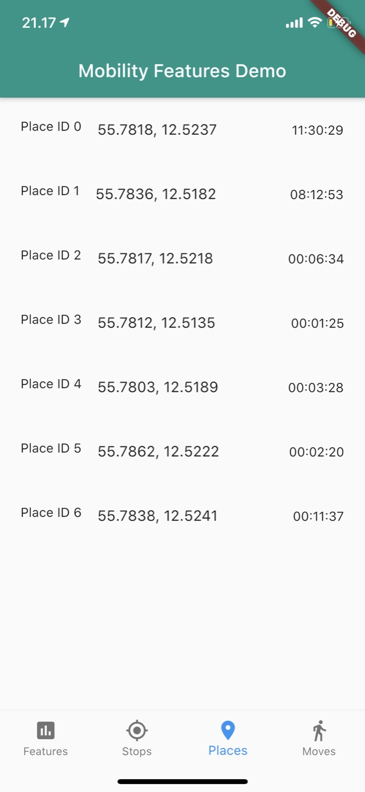
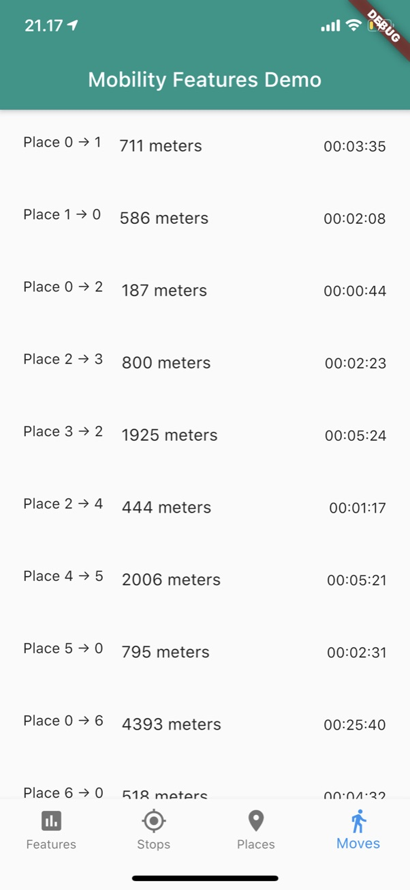

# Mobility Features
Author: Thomas Nilsson (tnni@dtu.dk)

## Setup

Add the package to your `pubspec.yaml` file and import the package

No permissions are required to use the package, however, a location plugin should be used to stream data. 

We recommend our own plugin `https://pub.dev/packages/carp_background_location` which works on both Android and iOS as of August 2020.

```dart
import 'package:mobility_features/mobility_features.dart';
```

### Step 1: Init the MobilityFactory instance
```dart
MobilityFactory mobilityFactory = MobilityFactory.instance;
```

Optionally, the following configurations can be made, which will influence the algorithms for producing features. 

In general the stop radius should be kept low (5-20 meters) and the place radius somewhat higher (25-50 meters). 
Computation of features is triggered when users move around and change their geo-position.
Low parameter values will make the features more fine grained but will trigger computation more often.

```dart

StreamSubscription<MobilityContext> mobilitySubscription;
MobilityFactory mobilityFactory = MobilityFactory.instance;
MobilityContext _mobilityContext;

void initState() {
    ...
    mobilityFactory.stopDuration = Duration(seconds: 30);
    mobilityFactory.placeRadius = 20;
    mobilityFactory.stopRadius = 5;
}
```

### Step 2: Set up streaming
Location data collection is not directly supported by this package, for this you have to use a location plugin such as `https://pub.dev/packages/mubs_background_location`. 

From here, you can to convert from whichever Data Transfer Object is used 
by the location plugin to a `LocationSample`. 

Next, you need to subscribe to the MobilityFactory instance's `contextStream` to be be notified each time a new set of features has been computed. 

Below is shown an example using the `mubs_background_location` plugin, where a `LocationDto` stream is converted into a `LocationSample` stream by using a map-function.

```dart
/// Start the streaming of location data and mobility features
void streamInit() async {
    /// Get the location data stream (specific to mubs_background_location)
    Stream<LocationDto> dtoStream = locationManager.dtoStream;
    
    /// Start the location service (specific to mubs_background_location)
    await locationManager.start();
    
    /// Convert from [LocationDto] to [LocationSample]
    Stream<LocationSample> locationSampleStream = dtoStream.map((e) =>
        LocationSample(GeoLocation(e.latitude, e.longitude), DateTime.now()));

    /// Provide the MobilityFactory instance with the LocationSample stream
    mobilityFactory.startListening(locationSampleStream);
    
    /// Start listening to incoming MobilityContext objects
    mobilityFactory.contextStream.listen(onMobilityContext);
}
```

### Step 3: Handle features
A call-back method is used to handle incoming MobilityContext objects:

```dart
/// Handle incoming contexts
void onMobilityContext(MobilityContext context) {
  /// Do something with the context
  print('Context received: ${context.toJson()}');
}
```

All features are implemented as getters for a `MobilityContext` object.
```dart
/// Location features
context.places;
context.stops;
context.moves;

/// Derived features
context.numberOfPlaces;
context.homeStay;
context.entropy;
context.normalizedEntropy;
context.distanceTravelled;
```

### Example
The example application included in the package shows the feature values, including separate pages for stops, moves and places.







### Feature errors
When a feature cannot be evaluated, it will result in a value of -1.0.

Examples:
* The Home Stay feature requires at least *some* data to be collected between 00:00 and 06:00, otherwise the feature cannot be evaluated. 

* The Entropy and Normalized Entropy features require at least 2 places 
to be evaluated. If only a single place was found, 
this will result in an Entropy of 0.

## Theorical Background
For mental health research, location data, together with a time component, 
both collected from the user’s smartphone, can be reduced to certain behavioral 
features pertaining to the user’s mobility. 
These features can be used to diagnose patients suffering from mental disorders such as depression. 

Previously, mobility recognition has been done in an off-device fashion where features are extracted 
after a study was completed. We propose performing mobility feature extracting in real-time on the device 
itself, as new data comes in a continuous fashion. This trades compute power, i.e. 
phone battery for bandwidth and storage since the reduced features take up much less space than the raw GPS data, 
and transforms the very intrusive GPS data to abstract features, which avoids unnecessary logging of sensitive data.

### Location Features
The mobility features which will be used are derived from GPS location data are:

**Stop**
A collection of GPS points which together represent a visit at a known `Place` (see below) for an extended period of time. A `Stop` is defined by a location that represents the centroid of a collection of data points, from which a  is created. In addition a `Stop` also has an `arrival` and a `departure` time-stamp, representing when the user arrived at the place and when the user left the place. From the arrival- and departure timestamps of the **Stop** the duration can be computed.

**Place**
A group of stops that were clustered by the DBSCAN algorithm. From the cluster of stops, the centroid of the stops can be found, i.e. the center location. In addition, it can be computed how long a user has visited a given place by summing over the duration of all the stops at that place.

**Move**
The travel between two Stops, which the user will pass though a path of GPS points. The distance of a Move can be computed as the sum of using the haversine distance of this path. Given the distance travelled as well as departure and arrival timestamp from the Stops, the average speed at which the user traveled can be derived. 

### Derived Features
**Home Stay**
The portion (percentage) of the total time elapsed since midnight which was spent at home. Elapsed time is calculated from the departure time of the last known stop.

**Location Variance**
The statistical variance in the latitude- and longitudinal coordinates.

**Number of Places**
The number of places visited today.

**Entropy**
The entropy with respect to time spent at places.

**Normalized Entropy**
The normalized entropy with respect to time spent at places.

**Distance Travelled**
The total distance travelled today (in meters), i.e. not limited to walking or running.
