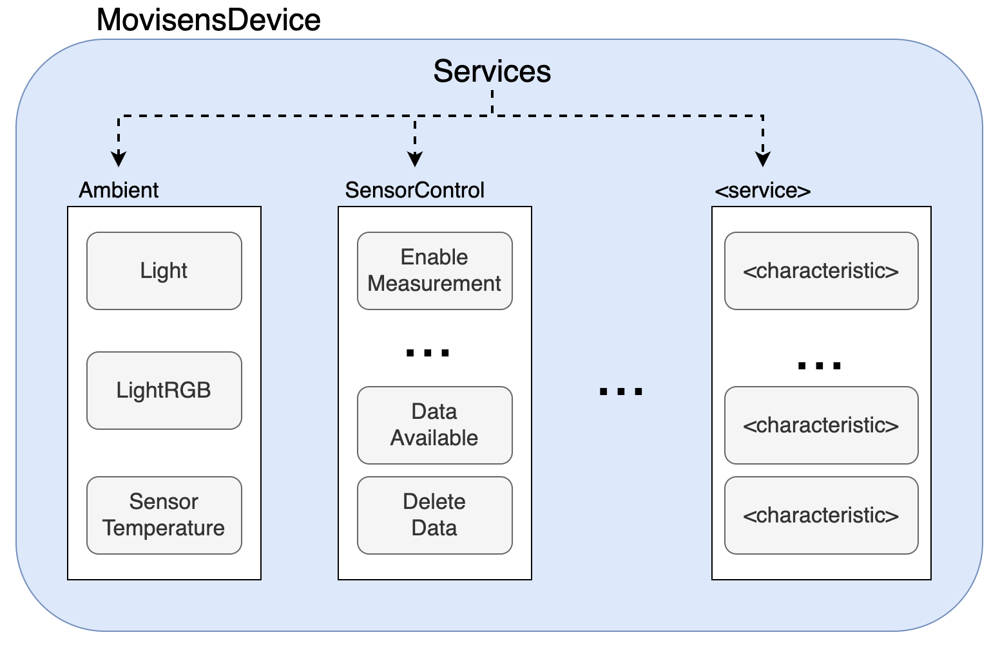

# Movisens Flutter Plugin

[](https://pub.dartlang.org/packages/movisens_flutter)

A plugin for connecting and collecting data from a Movisens sensor. **This plugin works for both Android and iOS.**

## Install

Add `movisens_flutter` as a dependency in `pubspec.yaml`.
For help on adding as a dependency, view the [documentation](https://flutter.io/using-packages/).

## Android

### Permissions

Add the following to your `android/app/src/main/AndroidManifest.xml`

```dart
    <uses-permission android:name="android.permission.BLUETOOTH" />
    <uses-permission android:name="android.permission.BLUETOOTH_ADMIN" />
    <uses-permission android:name="android.permission.ACCESS_COARSE_LOCATION"/>
```

### AndroidManifest.xml

Update the `android/app/build.gradle` to `minSdkVersion` at least 19

```gradle
android {
  defaultConfig {
      ...
      minSdkVersion 19
      ...
  }
}
```

## iOS

For release builds add the following to your `ios/Runner/Info.plist` :

```
<dict>
  <key>NSBluetoothAlwaysUsageDescription</key>
  <string>Need BLE permission</string>
  <key>NSBluetoothPeripheralUsageDescription</key>
  <string>Need BLE permission</string>
  <key>NSLocationAlwaysAndWhenInUseUsageDescription</key>
  <string>Need Location permission</string>
  <key>NSLocationAlwaysUsageDescription</key>
  <string>Need Location permission</string>
  <key>NSLocationWhenInUseUsageDescription</key>
  <string>Need Location permission</string>
```

## API

The `movisens_flutter` package is a Movisens-specific implementation of Bluetooth API.

At the top level you have a `MovisensDevice`. The device has a list of `MovisensService`s which split the data into categories of data.

Each service has a 1 or more `MovisensBluetoothCharacteristics`. Each characteristic is one data type. It can either be a stream of values such as `SensorTemperatureEvents` or a read/write such as `setDeleteData()`.


## Example Usage

### Intialization:

To connect to a Movisens device, you must know its MAC address.
Using the MAC address you can build a `MovisensDevice` and connect.

Connecting might take a upwards of 10 seconds as the device has to both connect and load all its features.

```dart
// The MAC address of your device
String deviceMACAddress = "88:6B:0F:CD:EC:AE";
// Your device
MovisensDevice device = MovisensDevice(macAddress: deviceMACAddress);

// Connect to the device. This
await device.connect();
```

### Start Listening to streams

To listen to a movisens device, you must enable the device to notify you when it records data.
This is done using the `enableNotify()` which enables **ALL characteristics** in a service.

```dart
// Enable the device to emit all event for each service:
await device.ambientService?.enableNotify();
await device.edaService?.enableNotify();
await device.hrvService?.enableNotify();
await device.markerService?.enableNotify();
await device.batteryService?.enableNotify();
await device.physicalActivityService?.enableNotify();
await device.respirationService?.enableNotify();
await device.sensorControlService?.enableNotify();
await device.skinTemperatureService?.enableNotify();
```

Once the services are enabled, you can listen to the `events` stream of the service which contains **all** data emitted by all the characteristics in that perticular service.

Alternatively, you can listen to each specific characteristic such as `skinTemperatureEvents` and only receive event from that type.

### Use read/write functions

Certain characteristics are not streamed and must be used with read/write actions.
E.g. deleting data from the device requires a write to the device.

```dart
// Deletion of data
await device.sensorControlService?.setDeleteData(true);
```

This will delete data on the device, given that no measurement is running.

### Disconnect

To stop listening and disconnect you simply use `disconnect()` on the device.

```dart
await device.disconnect();
```

## Example App

The example app showcases most of the features `movisens_flutter` has - just remember to set the MAC address to your own device.
