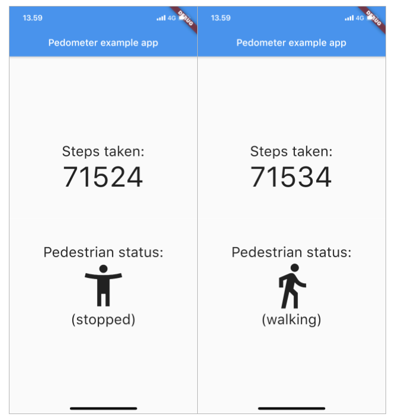

# pedometer

[](https://pub.dartlang.org/packages/pedometer)

This plugin allows for continuous step counting and pedestrian status using the built-in pedometer sensor API of iOS and Android devices.



## Permissions for Android
For Android 10 and above add the following permission to the Android manifest:

```dart
<uses-permission android:name="android.permission.ACTIVITY_RECOGNITION" />
```

## Permissions for iOS
Add the following entries to your Info.plist file in the Runner xcode project:

```xml
<key>NSMotionUsageDescription</key>
<string>This application tracks your steps</string>
<key>UIBackgroundModes</key>
<array>
    <string>processing</string>
</array>
```

## Step Count
The step count represents the number of steps taken since the last system boot. 
On Android, any steps taken before installing the application will not be counted.

## Pedestrian Status
The Pedestrian status is either `walking` or `stopped`. In the case that of an error, 
the status will be `unknown`.

## Example Usage

``` dart
Stream<StepCount> _stepCountStream;
Stream<PedestrianStatus> _stepDetectionStream;

void someMethod() {
    _stepDetectionStream = await Pedometer.pedestrianStatusStream;
    _stepDetectionStream.listen(onPedestrianStatusChanged);
    
    _stepCountStream = await Pedometer.stepCountStream;
    _stepCountStream.listen(onStepCount);
}

void onStepCount(StepCount event) {
    int steps = event.steps;
    int Datetime = event.timestamp;
}

void onPedestrianStatusChanged(PedestrianStatus event) {
    String status = event.status;
    int Datetime = event.timestamp;
}
```


See the [example app](https://github.com/cph-cachet/flutter-plugins/blob/master/packages/pedometer/example/lib/main.dart) for a full example.

